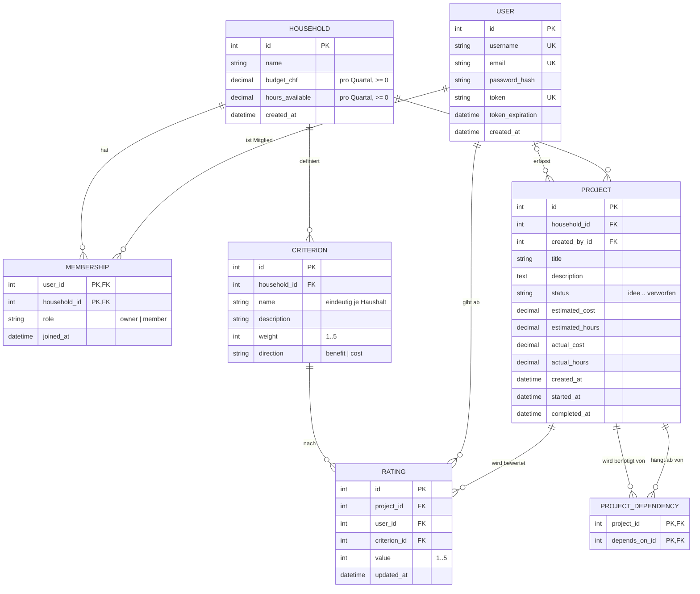
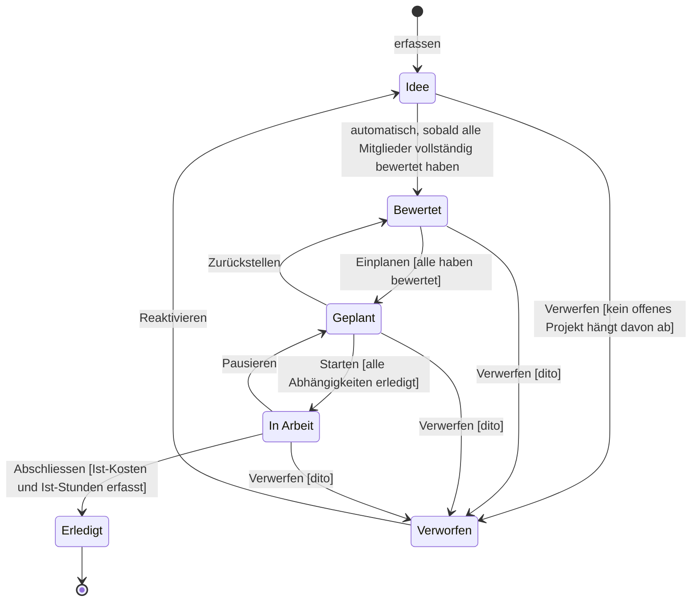
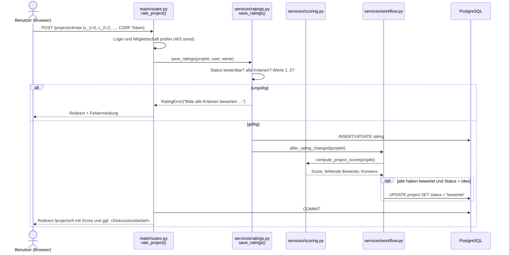
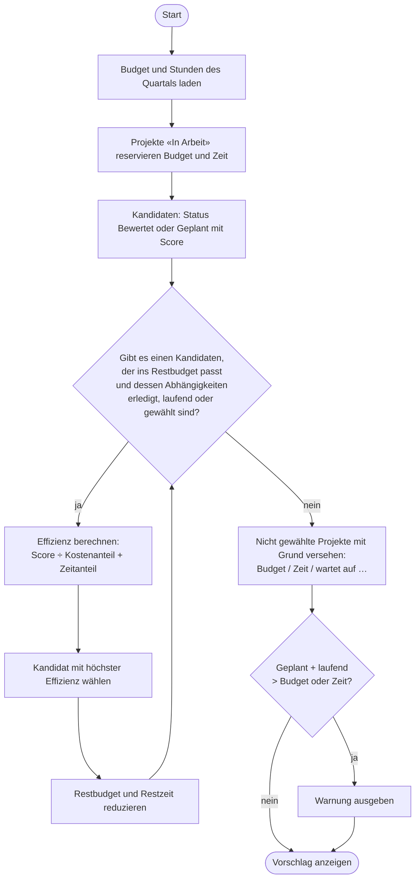
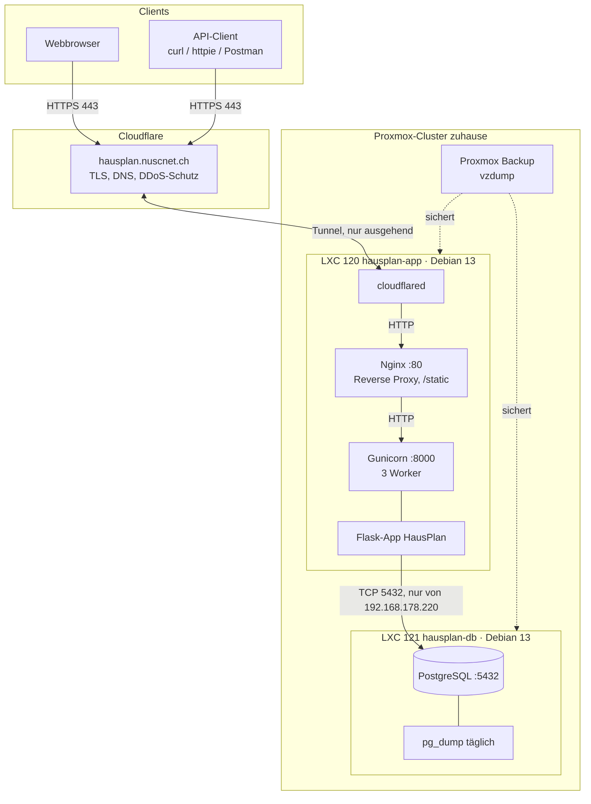

# Architektur von HausPlan

Grundlage für das Kapitel «Anwendung → Architektur» der Praxisarbeit. Die Diagramme sind in
[Mermaid](https://mermaid.js.org) geschrieben; GitHub stellt sie direkt dar. Für das PDF können sie
z. B. mit dem [Mermaid Live Editor](https://mermaid.live) als PNG/SVG exportiert werden
(fertige Exporte liegen in `docs/diagramme/`).

## 1. Schichten und Code-Struktur

```
hausplan/
├── hausplan.py          Einstiegspunkt (Flask-CLI, Gunicorn: hausplan:app)
├── config.py            Konfiguration aus Umgebungsvariablen (.env)
├── app/
│   ├── __init__.py      Application Factory, Erweiterungen, Blueprints, ProxyFix
│   ├── models.py        Datenmodell (SQLAlchemy)
│   ├── services/        GESCHÄFTSLOGIK – unabhängig von Web und API
│   │   ├── scoring.py       Nutzwertanalyse, Konsens-Erkennung, Ranking
│   │   ├── workflow.py      Zustandsautomat mit Regeln (Guards)
│   │   ├── dependencies.py  Abhängigkeiten, Zyklenerkennung, topologische Sortierung
│   │   ├── planning.py      Budget-Vorschlag (Greedy), Schätzgenauigkeit
│   │   ├── ratings.py       Bewertung speichern + Validierung
│   │   └── access.py        Berechtigungen (Mitglied / Besitzer)
│   ├── auth/            Blueprint: Registrierung, Login, Logout
│   ├── main/            Blueprint: Weboberfläche (Formulare mit Flask-WTF)
│   ├── api/             Blueprint: REST-API mit Token-Auth (Flask-HTTPAuth)
│   ├── templates/       Jinja2-Templates (Bootstrap 5, lokal ausgeliefert)
│   └── cli.py           flask seed / flask create-user
├── migrations/          Alembic-Migrationen (Flask-Migrate)
├── tests/               pytest (30 automatisierte Tests)
└── deploy/              systemd, Nginx, cloudflared, Setup- und Backup-Skripte
```

Die Trennung in `services/` ist die wichtigste Abweichung vom Aufbau des Unterrichts: Web-Routen und
API-Endpunkte rufen dieselben Funktionen auf. So gelten die Regeln überall gleich und lassen sich ohne
HTTP direkt testen.

## 2. Datenmodell (ERD)



**Beschreibung:**

* **User ↔ Household (n:m)** über die Assoziationstabelle `membership` mit dem Zusatzattribut `role`.
  Eine Person kann in mehreren Haushalten sein (z. B. eigene Wohnung und WG des Bruders).
* **Criterion** gehört zu genau einem Haushalt. So kann jeder Haushalt eigene Kriterien und Gewichte festlegen.
* **Rating** ist die Bewertung einer Person für ein Projekt nach einem Kriterium. Der Unique-Constraint
  `(project_id, user_id, criterion_id)` verhindert Doppelbewertungen, ein Check-Constraint erzwingt 1–5.
* **project_dependency** ist eine n:m-Selbstbeziehung von `project` (gleiches Muster wie «Followers» im
  Mega-Tutorial). Zyklenfreiheit kann die Datenbank nicht prüfen; das übernimmt `services/dependencies.py`.
* Check-Constraints in der Datenbank (Status-Werte, Bereiche, nicht-negative Beträge) sichern die
  Datenintegrität zusätzlich zur Validierung in Python ab.

## 3. Zustandsdiagramm: Projekt-Workflow



Die Bedingungen in eckigen Klammern sind Guards in `services/workflow.py::check_transition()`.
Ist ein Übergang gesperrt, zeigt die Oberfläche den Button deaktiviert mit dem Grund an.

## 4. Sequenzdiagramm: Bewertung abgeben



## 5. Aktivitätsdiagramm: Budget-Vorschlag «Was liegt drin?»



## 6. Bereitstellungsdiagramm



| Komponente | Aufgabe |
|---|---|
| Cloudflare Edge | Öffentlicher DNS-Name, TLS-Zertifikat, Schutz vor Angriffen; die Heim-IP bleibt verborgen |
| cloudflared | Baut eine ausgehende Verbindung zu Cloudflare auf; keine Portfreigabe am Router nötig |
| Nginx | Reverse Proxy, liefert statische Dateien aus, setzt die echte Client-IP (`CF-Connecting-IP`) |
| Gunicorn | WSGI-Server mit mehreren Worker-Prozessen, als systemd-Dienst mit automatischem Neustart |
| Flask-App | Weboberfläche, API, Geschäftslogik |
| PostgreSQL | Relationale Datenbank in eigenem Container, nur vom App-Container erreichbar |
| Backups | `pg_dump` (logisch, täglich) und vzdump (ganze Container) |

## 7. Zusätzliche Technologien (nicht im Unterricht) mit Begründung

| Technologie | Wozu | Begründung | Quelle |
|---|---|---|---|
| Proxmox VE (LXC) | Virtualisierung | Vorhandene Infrastruktur, Container getrennt sicherbar und wiederherstellbar | https://pve.proxmox.com/wiki/Linux_Container |
| Cloudflare Tunnel | Veröffentlichung im Internet | Kein offener Port, kostenloses TLS, verbirgt Heim-IP, dynamische IP kein Problem | https://developers.cloudflare.com/cloudflare-one/connections/connect-networks/ |
| Werkzeug ProxyFix | Korrekte Client-IP und Schema hinter Proxy | Ohne ProxyFix generiert Flask falsche URLs (http statt https) | https://flask.palletsprojects.com/en/latest/deploying/proxy_fix/ |
| pytest | Automatisierte Tests | Standard im Python-Umfeld, Fixtures für frische Test-DB | https://docs.pytest.org |
| Bootstrap 5 (lokal) | Gestaltung | Lokal statt CDN ausgeliefert, damit die App nicht von einem fremden Server abhängt | https://getbootstrap.com |

## 8. Algorithmen und Quellen

| Funktion | Verfahren | Quelle |
|---|---|---|
| Score | Gewichtete Nutzwertanalyse, Kosten-Kriterien invertiert, Skala 0–100 | Zangemeister, C. (1976). *Nutzwertanalyse in der Systemtechnik* (4. Aufl.). München: Wittemannsche Buchhandlung. |
| Reihenfolge | Topologische Sortierung nach Kahn mit Prioritätswarteschlange (Score) | Kahn, A. B. (1962). Topological sorting of large networks. *Communications of the ACM, 5*(11), 558–562. |
| Zyklenerkennung | Tiefensuche (DFS) vor dem Einfügen einer Kante | Cormen, T. H. et al. (2022). *Introduction to Algorithms* (4. Aufl.), MIT Press. |
| Budget-Vorschlag | Greedy-Heuristik für das (mehrdimensionale) Rucksackproblem: Nutzen pro Ressourcenanteil | Dantzig, G. B. (1957). Discrete-variable extremum problems. *Operations Research, 5*(2), 266–288. |

## 9. Reflexion – Stichworte

**Wartbarkeit**
* + Geschäftslogik in `services/` gekapselt und mit 30 Tests abgedeckt; Web und API teilen den Code.
* + Datenbankschema versioniert (Alembic), Deployment per Skript reproduzierbar.
* − Server-gerenderte Seiten: Interaktivität begrenzt; mehr JavaScript würde Komplexität erhöhen.

**Skalierbarkeit**
* + Gunicorn-Worker und App-Container sind zustandslos (Sessions im signierten Cookie) und könnten horizontal skaliert werden.
* − Scores werden bei jedem Aufruf berechnet. Für einen Haushalt (≈ 10–100 Projekte) unkritisch; bei
  vielen Projekten wären Caching oder gespeicherte Scores nötig.
* − Greedy liefert nicht immer das Optimum; für exakte Lösungen wäre dynamische Programmierung nötig (bei kleinen Mengen machbar).

**Verfügbarkeit**
* + Automatischer Neustart (systemd `Restart=always`, Proxmox `onboot`), Cloudflare puffert DDoS.
* − Grösstes Risiko: Heimanschluss und Strom sind Single Points of Failure; ohne gemeinsamen Speicher kein HA-Failover.
* − Gegenmassnahmen: Backups (vzdump + pg_dump), Monitoring mit Alarm, dokumentiertes Restore, keine Updates in der Korrekturzeit.
